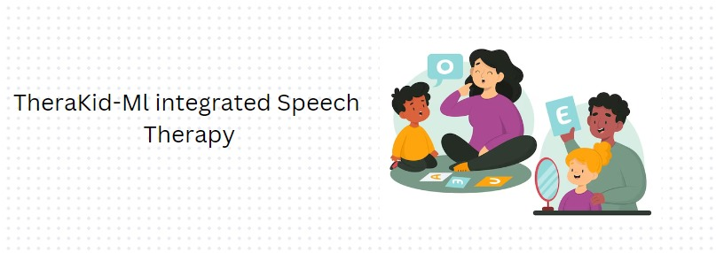
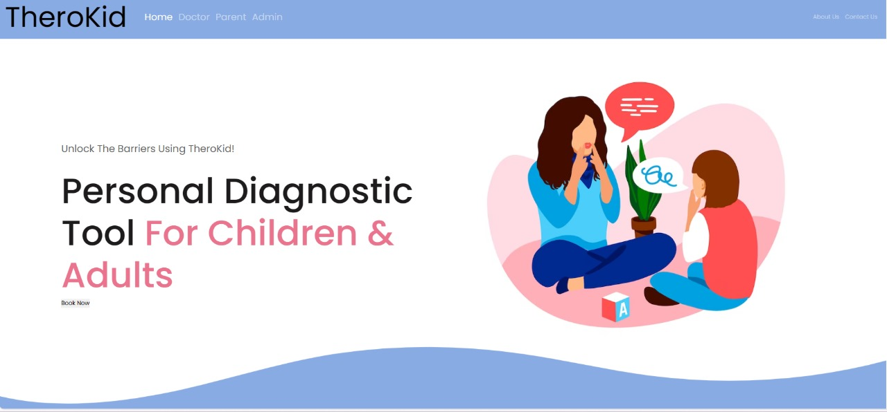
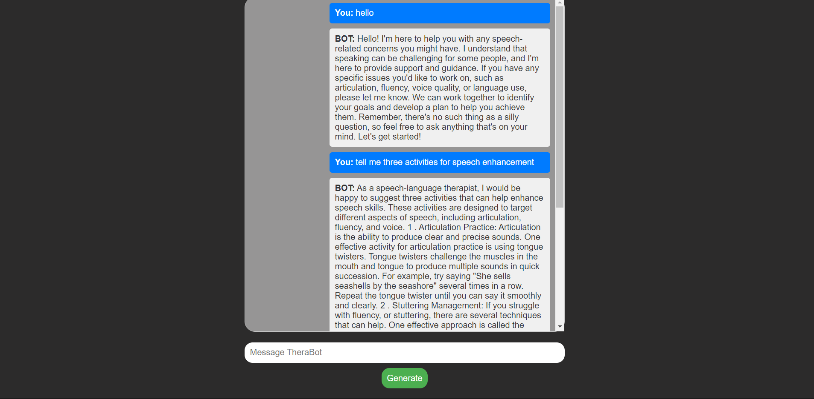

<!-- PROJECT LOGO -->
 

  

  <h1 align="center">Speech Therapy - Machine Learning Integrated Speech Learning Platform</h1>

  

    Welcome to our project!
     
     
<!--     <a href="https://drive.google.com/file/d/1itKq5K-_9NWnvV7kbW4jGxd6lTLQHwen/view?usp=sharing">View Video</a>
 -->
  

<!-- TABLE OF CONTENTS -->

  
Table of Contents

  <ol>
    <li>
      <a href="#about-the-project">About the Project</a>
      <ul>
        <li><a href="#built-with">Built With</a></li>
        <li><a href=#social-impact>Social Impact</a></li>
      </ul>
    </li>
    <li>
      <a href="#intel-oneapi">Intel® OneAPI</a>
      <ul>
        <li><a href="#intel-oneapi">Use of oneAPI in our project</a></li>
      </ul>
    </li>
    <li><a href="#what-it-does">What it does</a></li>
    <li><a href="#how-we-built-it">How we built it</a></li>
    <li><a href="#what-we-learned">What we learned</a></li>
  </ol>

<!-- ABOUT THE PROJECT -->
## About The Project

  

Welcome to our platform! Here, we integrate cutting-edge machine learning technology from Hugging Face to assist with speech therapy. Our tools are tailored for doctors, parents, and administrators, making speech assessment and treatment more accessible and efficient. With intuitive features, we simplify addressing speech challenges, ultimately enhancing communication skills.  advanced technology to revolutionize speech therapy and improve outcomes for all involved.

## Screensots

#### Innovating Speech Therapy: Introducing Groundbreaking Tools for Assessment and Treatment,
#### Intel® oneAPI is used to optimize the models to provide accurate and efficient prediction

### Social Impact 
The "Diagnosify - Brain Disease Classification" project has the potential to create significant social impact in several ways:

1. Early Detection and Treatment: By accurately predicting diseases like brain tumors, Alzheimer's, and Parkinson's Disease, the project can enable early detection and intervention. Early diagnosis often leads to more effective treatment options and improved patient outcomes.
2. Healthcare Access: Diagnosify can extend medical expertise to underserved and remote areas where access to specialized healthcare may be limited. This democratization of medical diagnosis can ensure that individuals in various geographical locations receive timely and accurate predictions.
3. Reduced Misdiagnosis: Machine learning algorithms used in the project can help reduce instances of misdiagnosis by analyzing intricate patterns that might be challenging for human experts to identify. This can prevent unnecessary treatments and procedures while increasing the accuracy of diagnoses.

4. Collaborative Healthcare: The project promotes collaboration between medical professionals and technology. This synergy can lead to a more comprehensive understanding of diseases and their characteristics, fostering a collaborative approach to healthcare.

### Built With 
Our platform harnesses the power of Django for backend infrastructure, Hugging Face for advanced natural language processing, Python for seamless integration, and Jupyter for interactive model development. Leveraging Intel's cloud infrastructure ensures optimal performance, empowering us to deliver an innovative solution for speech therapy with tailored functionalities for diverse users.

* [![Django][django-logo]][django-url]
* [![Hugging Face][hugging-face-logo]][hugging-face-url]
* [![Python][python-logo]][python-url]
* [![Jupyter][jupyter-logo]][jupyter-url]
* Intel Developer Cloud (No specific logo provided)

<!-- Hugging face  intel neural chat 7b -->
## Hugging face  intel neural chat 7b

Intel Neural-Chat 7b is a conversational AI model developed by Intel, designed to engage in natural language conversations. Built upon cutting-edge neural network architectures, such as transformers, Intel Neural-Chat 7b possesses advanced capabilities in understanding and generating human-like responses. This model is trained on vast amounts of text data, allowing it to grasp nuances of language and context, enabling more coherent and contextually relevant interactions. Intel Neural-Chat 7b represents a significant advancement in conversational AI technology, offering potential applications in customer service, virtual assistants, and various other domains requiring natural language understanding and generation.

# Benefits of NeuralChat 7b

## Direct Preference Optimization: Aligning with Human Preferences
A distinctive aspect of the NeuralChat 7b model's development was the application of the DPO algorithm. This algorithm, both stable and computationally lightweight, aimed to align model responses with human preferences. Leveraging a dataset containing 12k examples from the Orca style dataset, the team employed the llama-2–13b-chat model to generate responses, ensuring a nuanced understanding of acceptable versus rejected responses.

## Inference Excellence
Compatibility with Transformers ensures seamless inference using the NeuralChat model. Employing the same launcher code for inference in FP32 and enabling BF16 inference using Optimum-Habana further amplifies its inference performance, promising swift and accurate responses.

## Supervised Fine-Tuning with Intel Extension for Transformers
Utilizing the mistralai/Mistral-7B-v0.1 as the base model, the Intel Extension for Transformers facilitates supervised fine-tuning. Leveraging the Open-Orca/SlimOrca dataset and DeepSpeed ZeRO-2, this process tailors the model to specific requirements while adhering to commercial-friendly licenses.

 *Import Libraries and Load Model*

To load the model and configure it with specific settings, the following Python code can be used:

python
import torch
from transformers import AutoTokenizer, AutoModelForCausalLM, BitsAndBytesConfig, AutoProcessor

# Import necessary libraries and modules

# Define BitsAndBytesConfig with custom settings
bnb_config = BitsAndBytesConfig(
    load_in_4bit=True,
    bnb_4bit_use_double_quant=True,
    bnb_4bit_quant_type="nf4",
    bnb_4bit_compute_dtype=torch.bfloat16
)

# Define model identifier
model_id = "Intel/neural-chat-7b-v3-1"

# Load pre-trained model using AutoModelForCausalLM
model = AutoModelForCausalLM.from_pretrained(model_id)

<!-- Intel one api -->
## Intel® oneAPI
Intel® OneAPI is a comprehensive development platform for building high-performance, cross-architecture applications. It provides a unified programming model, tools, and libraries that allow developers to optimize their applications for Intel® CPUs, GPUs, FPGAs, and other hardware. Intel® OneAPI includes support for popular programming languages like C++, Python, and Fortran, as well as frameworks for deep learning, high-performance computing, and data analytics. With Intel® OneAPI, developers can build applications that can run on a variety of hardware platforms, and take advantage of the performance benefits of Intel® architectures.
<!-- Use of oneAPI in our project -->

### Use of oneAPI in our project

In this section, we'll outline how we utilized various Intel® oneAPI libraries and frameworks to enhance the performance and efficiency of our models.

* *Intel® oneAPI Deep Neural Network Library (oneDNN)*

To optimize deep learning applications on Intel® CPUs and GPUs, we integrated the oneAPI Deep Neural Network Library (oneDNN). To enable oneDNN optimizations for TensorFlow* running on Intel® hardware, we used the following code:

python
import os
os.environ['TF_ENABLE_ONEDNN_OPTS'] = '1'
os.environ['DNNL_ENGINE_LIMIT_CPU_CAPABILITIES'] = '0'

#### Model Specifics and Usage
Alzheimer's Disease Prediction and Brain Tumor Detection models are TensorFlow-based. For these, We used the Intel® Extension for TensorFlow* from the AI Kit, oneDAL, oneDPL and oneDNN to enhance performance. Parkinson's Disease Detector was optimized using the Intel® Extension for Scikit-learn from oneDAL.

### Performance Comparison
The following graphs illustrate the substantial performance improvements 
1. Comparing execution time of intel/neural chat and mistral  
  
2. Comparing token generation of intel/neural chat 7b and mistralbr> 
  

<!-- What it does -->
### What Does Speech Therapy Do?

Speech therapy, also referred to as speech-language pathology, is a specialized field dedicated to assessing, diagnosing, and treating various communication disorders. These disorders encompass challenges related to speech, language, voice, fluency, and swallowing. Speech therapists collaborate with individuals across all age groups, from infants to seniors, to enhance their communication abilities and overall quality of life.

- *Assessment*: Speech therapists conduct thorough evaluations to identify speech and language impairments, pinpointing their root causes and severity levels.

- *Treatment*: Drawing from assessment findings, therapists devise personalized treatment plans tailored to meet the unique needs of each individual. These plans encompass a range of techniques and exercises designed to enhance speech articulation, language comprehension and expression, voice clarity, and fluency.

- *Intervention*: Therapists engage closely with clients to implement targeted intervention strategies aimed at achieving specific communication objectives. These strategies may involve structured speech exercises, language drills, cognitive-communication tasks, or alternative communication methods.

- *Education and Support*: In addition to direct therapy sessions, speech therapists educate clients and their families on communication disorders, imparting practical strategies for improving communication in various settings such as home, school, and social environments. Furthermore, they provide emotional support and counseling to individuals and families navigating the challenges associated with communication disorders.
.

## How we built it 
These are the steps involved in making this project: 
* Importing Libraries
* Data Importing
* Data Exploration
* Data Configuration
* Preparing the Data
  * Creating a Generator for Training Set
  * Creating a Generator for Testing Set
* Model Creation
* Model Compilation
* Training the Model 
* Testing Predictions

## What We Learned

✅ Developing our speech therapy platform has been a transformative journey, offering invaluable insights into the intersection of technology and healthcare. Here's a summary of key learnings from this experience:

- *User-Centric Design*: Crafting a user-friendly interface and tailored functionalities required deep empathy and understanding of the needs of speech therapists, doctors, parents, and administrators. We learned to prioritize user experience and accessibility in our design decisions.

- *Integration of Machine Learning*: Implementing state-of-the-art machine learning technology from Hugging Face and optimizing the code with Intel oneAPI enabled us to enhance speech assessment and therapy processes. We gained expertise in leveraging natural language processing algorithms for context-aware interactions and personalized interventions while ensuring efficient performance across various hardware architectures.

- *Hardware Optimization Expertise*: Integrating Intel oneAPIs alongside oneDNN exposed us to advanced techniques for optimizing machine learning models on diverse hardware architectures. We gained insights into harnessing the full potential of CPUs, GPUs, and other accelerators, enhancing our ability to design efficient and high-performance solutions.

- *Impact on Healthcare Accessibility*: Our platform's potential to democratize access to speech therapy services underscored the transformative impact of technology on healthcare accessibility. We learned to harness technology to address disparities in healthcare provision and improve outcomes for diverse communities.

- *Social Responsibility*: Building a platform with the potential to positively impact individuals' lives reinforced our sense of social responsibility. We recognized the power of technology to drive positive change in healthcare and society, inspiring us to strive for greater inclusivity and equity in our work.

## Conclusion 

Our journey in developing the speech therapy platform has been one of profound discovery and innovation. Through the integration of cutting-edge technologies such as machine learning, user-centric design principles, hardware optimization expertise, and the utilization of Intel oneAPI and oneDNN, we have created a solution that not only addresses the needs of speech therapists and their clients but also contributes to greater accessibility and inclusivity in healthcare.

By prioritizing user experience and continuously improving our platform based on feedback and advancements in technology, we are committed to delivering impactful solutions that enhance communication skills and quality of life for individuals of all ages. Our dedication to social responsibility underscores our mission to leverage technology for the betterment of healthcare and society as a whole.

In conclusion, our speech therapy platform stands as a testament to the transformative power of technology in improving healthcare outcomes and fostering greater equity and accessibility in speech therapy services.